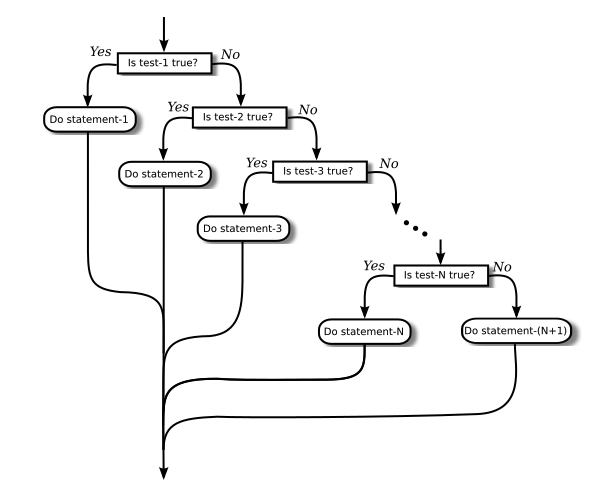

# 23.11.06(월) Chapter 03

# Section1 - Blocks, Loops and Branches

### 흐름을 결정짓는 요소 6가지

1. block
2. while loop
3. do while loop
4. for loop
5. if statement
6. switch statement

---

### Blocks

```java
{  // This block exchanges the values of x and y
   int temp;      // A temporary variable for use in this block.
   temp = x;      // Save a copy of the value of x in temp.
   x = y;         // Copy the value of y into x.
   y = temp;      // Copy the value of temp into y.
}
```

Blocks 내부에 temp가 선언된다.

Blocks의 외부에서는 내부에 있는 temp가 보이지 않는다.

Blocks이 끝나면 해당 메모리는 폐기된다. (즉, 재사용이 가능하다) 이러한 변수는 블록에 대하여 지역적(local)이라고 한다.

Blocks은 실제로 프로그램의 흐름 제어에 영향을 미치는 것은 아니다.

### While

```java
while (boolean-expression) {
    statement
}
```

boolean-expression을 판단한 후에 true이면 statement를 실행한다.

### If

```java
if (boolean-expression)
    statement1
else
    statement2
```

boolean-expression이 true면 statement1을 실행하고, false이면 statement2를 실행한다.

.If and While flow


if 와 while loop의 Flow 차이

.If Else flow


if 와 else의 차이

---

# Section2 - Algorithm Development

알고리즘 → 단계별 작업 절차로 구체화하는 것

디버깅의 황금률(golden rule of debugging) → 프로그램의 모든 것이 옳다고 절대적으로 확신하지만 여전히 프로그램이 작동되지 않는다면, 절대적으로 확신하는 것 중 하나는 잘못되었다는 것

---

# Section3 - The while and do..while Statements

flag, flag variable → boolean 변수를 특정 부분에서 종료되는 조건으로 사용하는 경우

---

# Section4 - The for Statement

for loop에는 initialization, condition, updating이 첫 번째 줄에 결합되어 있기 때문에 루프를 읽고 이해하기 쉽게 한다.

.For loop flow


---

# Section5 - The if Statement

.If Statement flow


```java
System.out.printf("%14.5g inches%n", inches);
```

g → 실수가 매우 크거나 매우 작으면 지수 형식(Exponential form)으로, 그렇지 않으면 일반적인 소수 형식(decimal form)으로 출력된다.

---

# Section6 - The switch Statement

switch 표현식의 값은 int, short 또는 byte의 원시적 정수 자료형 중 하나가 될 수 있다. 원시적 char 자료형도 가능하고, *String* 도 될 수 있다. 또는 열거형일 수 있다(열거형에 대한 소개는 제2장 제3절 제4관 참조). 특히, 표현식이 double 또는 float 값이 **될 수 없다**는 점에 유의하라.

```java
switch ( N ) {   // (N은 정수인 변수로 가정한다.)
   case 1 -> System.out.println("숫자는 1.");
   case 2, 4, 8 -> {
      System.out.println("숫자는 2, 4, 또는 8.");
      System.out.println("(이는 2의 승수(power)임!)");
   }
   case 3, 6, 9 -> {
      System.out.println("숫자는 3, 6, 또는 9.");
      System.out.println("(이는 3의 배수(multiple)임!)");
   }
   case 5 -> System.out.println("숫자는 5.");
   default ->
      System.out.println("숫자는 7이거나 1부터 9 사이의 범위를 벗어남.");
}
```

자바 14에 추가된 switch문.
케이스안의 코드는 단일 문장이나 중괄호로 감싸진 여러 문장으로 구성된 블록문도 가능하다.

# Section8 - Introduction to Arrays

…