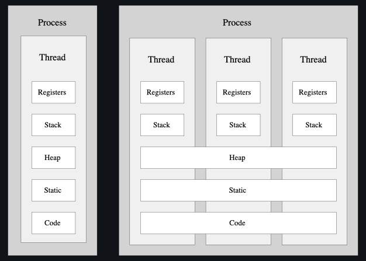
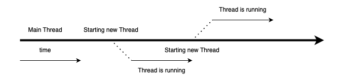
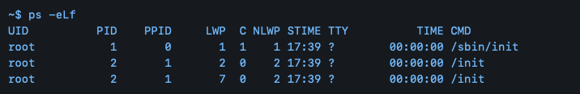
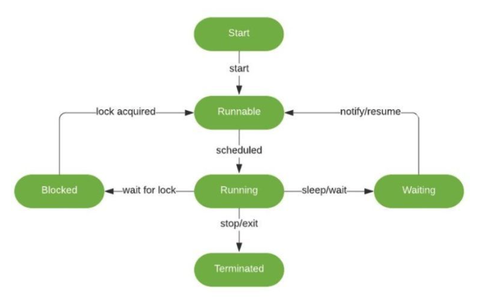

== 23.10.17(화) Thread 1, 2

=== process vs thread

==== What is the difference between Process and Thread

.Process vs Thread

[width="100%",cols="50%,50%",options="header",]
|===
|Process |Thread
|프로그램을 실행하기 위한 모든 자원들을 개별적으로 가지고 있음 |필요한
최소한의 자원들만 가져

|LWP(Light Weight Process)라고도 하는 경량 Process |

|process별로 자체 메모리를 가짐 |process내의 다른 thread와 메모리를 공유

|개별 메모리로 인해 process 간 통신이 느림 |

|process간의 통신은 OS에서 제공하는 다양한 통신 기술을 이용해야 함 |공유
메모리를 이용해 직접 통신이 가능 → Thread간 통신이 빠르다.

|Multi process 지원 시스템에서는 process context switching시 이전
process의 메모리 및 스택 정보를 storage에 저장하는 swapping이 발생할 수
있으며, 이는 메모리에 있던 정보를 storage에 옮기거나 storage에 저장된
정보를 메모리에 올리는 작업이 수행되므로 비용이 많이 듦. |Thread간
context 전환은 공유 메모리로 인해 비용이 저렴하다.

|구성 요소에 대한 여러 process가 있는 application은 메모리가 부족할 때
더 나은 메모리 활용도를 제공할 수 있다. |

|Application의 비활성 process에 낮은 우선 순위를 할당할 수 있다. 그러면
이 이후 process는 storage로 swapping될 수 있다. |메모리가 부족한 경우
Multi-threaded application은 메모리 관리를 위한 어떠한 조항도 제공하지
않는다.
|===

==== Process

* 실행중인 프로그램을 의
* 스케줄링의 대상이 되는 작업과 같은 의미로 쓰임
* Storage의 프로그램을 실행하면 실행을 위해서 메모리 할당이 이루어지고,
할당된 메모리 공간으로 바이너리 코드가 올라감 → 올라간 순간부터
process라고 불린다.
* Process는 하나 이상의 Thread 구성이 된다.

==== Thread

* Process와 유사하지만, 메모리의 많은 부분을 공유함 (Heap, Static, Code)
* Thread별로 Stack과 Register를 가지고 있음
* Thread of Control을 줄인 말로, 제어의 흐름을 시각적으로 표현

.Thread

* Thread in terminal
+
.Thread in terminal

** PID: process 식별자
** LWP: process내에서 thread 식별자
** NLWP: process에서 생성한 thread 개수

==== Single Thread vs Multi Thread

* Single Thread
+
Main thread에서 작업 진행, 작업은 순차적으로 진행됨
+
하나의 process에서 오직 하나의 thread로만 실행
** 단일 레지스터와 스택으로 구성
** Context Switching 작업을 요구하지 않음
** 동시성 제어에 대한 처리를 신경 쓰지 않아도 됨
* Multi Thread
+
프로그램 내에서 두 개 이상의 동작을 동시에 실행
** 프로세서의 활동을 극대화
** 두 개가 동작을 동시에 실행
+
하나의 프로세스를 다수의 실행 단위로 구분하여 자원을 공유
** 자원의 생성과 관리의 중복성 최소화
** 수행 능력 향상

'''''

=== Thread class extension

* Thread class를 확장해 thread로 동작하는 클래스를 만든다.
* Thread class 확장을 통해 여러 작업을 동시에 실행해 확인한다.
* Single thread 환경에서의 여러 작업을 실행하여 문제점을 확인한다.

==== Thread class hirerachy

* FunctionalInterface ← Runnable ← Thread

'''''

=== Multithreading Basics

==== Thread life cycle

.Thread life cycle

* 새로운 thread를 생성했을 때 → Start 상태.
* thread start() 했을 때 → Runnable 상태(ready to run)
* thread is waiting for a monitor lock 이고, 다른 thread가 점유중인
code에 접근하려 할 때 BLOCKED state에 들어간다.
* Waiting → wait()이 사용됐을 때 변경되는 상태. 다른 thread로부터의
신호를 기다린다.
* thread가 종료됐을 때 (정상적인 실행 종료 or 비정상적인 종료) thread는
Terminated 상태가 된다.
* thread에 interrupt가 걸리면 InterruptedException Error를 throw한다.
** InterruptedException (checked exception)
+
thread가 waiting, sleeping 등의 상태가 될 때 throw되는 Error.
interrupt()로 사용 가능

Thread의 scheduling은 JVM이 담당한다. JVM은 가상머신이기 때문에
multithreading을 지원하고 위해서는 native operating system(OS)가
필요하다.

interrupt ⇒ thread에게 실행중인 작업을 멈추라고 지시하는 것.

…
