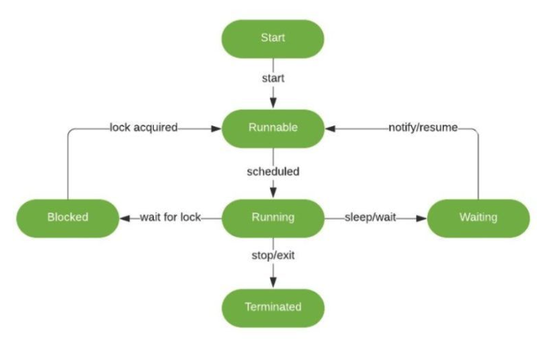

# 23.10.18(수) Thread 3,4,5

## Runnable interface

### 목표

- Runnable interface를 구현해 thread로 동작하는 클래스를 만듦
- Runnable interface 구현을 통해 여러 작업을 동시에 실행해 확인

### Runnable interface

- Thread를 상속받는 것 외에도 Runnable interface를 구현함으로써 새로운 Thread class를 정의할 수 있다.
- Thread class의 hierarchy를 보면 Thread class도 Runnable interface의 구현으로 정의되었음을 알 수 있다.

## what’s difference between Thread class and Runnable interface

| Thread class | Runnable interface | | --- | --- | | 자바는 Multiple inheritance를 지원하지 않으므로, 다른 class로 부터의 추가적인 확장이 불가능하다.
| Interface에 대한 multiple inheritance가 지원되고, 구현된 후에도 해당 class의 확장이 가능하다.
| | Instance 생성 후 바로 실행할 수 있다.
| Instance 생성 후 바로 사용할 수 없고, 추가적인 Thread object가 필요하다.
| | 간단한 class라도 별도의 class 정의가 필요하다.
| Runnable interface는 functional interface이기 때문에 Lambda로 구현가능하다.
|

## Thread stop

- thread는 start()로 시작하지만, 종료에 대한 명령어는 없다. (초기에는 stop() method를 지원하였지만, 현재는 안전성을 이유로 사용하지 않는 것을 권장)
- stop()은 thread를 즉시 중단시키는 method → thread가 실행 중인 상태에서 강제로 종료시켜 thread 내부에서 리소스 정리를 제대로 할 수 없게 되고, 이로 인해 프로그램이 예기치 않게 동작할 수 있다.
- stop()으로 lock을 해제하지 않은 채 종료된다면 다른 thread가 lock 획득을 위해 무한히 기다리는 deadlock 상태에 빠질 수 있다.
- 따라서 안전하게 종료하기 위해서는 thread 내에서 확인 가능할 수 있도록 상태를 전달해 스스로 종료할 수 있게 만들어야 한다.

- 과정 수행이 자동 종료가 되던 반복된 작업을 하던 공통적인 문제는 중간에 중단 시키고 싶을 경우 내부 흐름 상에서 계속 진행할 지에 대한 상태 표시가 필요하다.

### Stop flag vs Interrupt

.Thread life cycle

Interrupt로 Thread를 종료해야 하는 이유 (더 공부가 필요함)

- flag → flag로 stop을 할 경우 Running 상태에서 종료가 될 수 있다. 때문에 lock을 해제하지 않고 thread가 계속 메모리를 점유할 수도 있고, 비정상적인 종료로 인해서 잘못된 결과 또는 오류가 발생할 수 있기 때문에 좋은 방법이 아니다. (또는 thread가 종료되지 않을 수도?)
- Interrupt는 sleep(), wait() 등 Waiting 상태일 때 정상적인 종료를 한다고 가정.
(나중에 관련된 예제가 나오면 더 공부 필요)

---

…