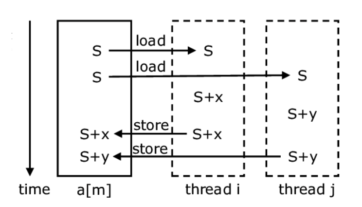

== 23.10.23(월) Thread - synchronization, state

== Synchronization

=== Race Condition(경쟁 조건)

* 둘 이상의 thread가 동시에 공유 자원 접근 시 발생한다.
* 첫 번째 thread와 두 번째 thread는 값에 대한 작업을 수행하고 변수에 마지막으로 값을 쓰기 위해 두 thread는 경쟁하게 되고
* 하나의 thread가 값을 쓰고, 다음 thread가 값을 덮어쓴다면 마지막에 쓴 thread의 값이 저장되어 원하는 결과를 얻지 못하게 될 것(첫 쓰레드의 계산 결과가 무의미해짐)이다.

.Thread Race Condition

총 S + x + y 의 값이 저장되어야 하지만 S + x의 결과가 무시되고 S + y만 덮어씌워져 저장됨

* 이처럼 하나 이상의 thread가 경쟁하는 문제를 **Race Condition(**경쟁 조건)이라고 하고, 동시 접근을 함으로써 문제가 발생할 수 있는 구역을
**Critical Section(**임계 구역)이라 한다.

=== Critical Section(임계 구역)

* 병렬 컴퓨팅에서 두 개 이상의 process 또는 thread가 동시 접근이 허용되지 않는 공유 자원에 접근하는 코드의 블록.
* thread에서 작업에 필요한 최소한의 시간 동안만 유지 되어야 하고, 작업 완료 후에는 반드시 해제되어야 한다.
* 따라서 한 thread가 critical section에 들어가고 작업이 진행 중이라면, 나머지 thread들은 해당 작업이 완료될 때까지 대기해야 한다.

=== Mutual Exclusion(상호 배제)

* 두 개 이상의 process 또는 thread가 동시에 하나의 공유 자원으로 발생할 수 있는 race condition 문제를 해결하기 위해 어느 시점에서의 공유 자원 접근을 하나의 process 혹은 thread로 제한하는 것을 말한다.

=== Deadlock(교착 상태)

* mutual exclusion 과정에서 자원 접근 권한 획득과 자원 접근 권한 반환 관계의 꼬임으로 발생한다.
* 교착 상태가 발생할 수 있는 조건 → Hold and wait, Circular Wait, Starvation, Livelock
** Hold and Wait (점유 대기)
+
사진에서의 process2 처럼 resource1의 **접근 권환을 획득한 상태에서 resource2의 접근 권한을 기다리고 있는 것**을 말한다.
+
.Hold And Wait
image::./images/2.hold_and_wait.png[Hold And Wait]
** Circular Wait (순환 대기)
+
Hold and Wait과 비슷하지만 순환 구조를 이루고 있는 것
+
.Circular Wait
image::./images/3.circular_wait.svg[Circular Wait]
** Starvation (기아 상태)
+
process나 thread가 공유 자원의 접근 권한을 지속적으로 가짐으로써 발생할 수 있다.
+
process나 thread가 공유 자원의 접근 권한을 해제하더라도 운영 방식등의 이유로 인해 해당 process나 thread가 공유 자원의 접근 권한을 획득하지 못하는 경우도 동일하다.
+
process나 thread의 우선순위가 다를 경우, 우선순위가 낮은 process나 thread는 scheduler에 의해 공유 자원에 대한 접근 권한을 획득할 만큼의 수행 시간을 갖지 못해 무한히 대기 상태에 놓일 수 있다.
** Livelock
+
deadlock 문제를 해결하기 위해 공유 자원 접근 요청 후 일정 시간 안에 권한 획득에 실패한 경우, 수행 과정을 종료하면서 발생할 수 있다.
+
두 개의 process나 thread에서 교착 상태를 유지하다 일정 시간 후 자원 접근 요청을 철회할 때, 두 개의 process나 thread가 동시에 수행하여 자신이 확보하고 있던 공유 자원 접근 권한을 반환하여 교착 상태가 해결된다.
하지만, 두 개의 process나 thread는 교착 상태와 같이 아무런 작업을 수행하지 못하는 것은 아니지만, 해당 자원에 대한 접근 권한을 확보하지 못해 관련된 작업을 수행하지 못하는 결과를 가져온다.
+
교착 상태는 관련된 process나 thread가 대기 상태를 계속 유지함으로써 여타의 작업 수행이 불가능하지만 livelock은 해당 자원에 대한 작업만 처리하지 못할 뿐 나머지 작업은 처리되는 차이를 가지고 있다.

==== synchronized keyword를 사용할 수 있는 곳

* Instance methods
* Static methods
* Code blocks

[source,java]
----
public synchronized void increment() {...}
----

==== wait() method → lock을 소유한 상태여야 한다.

* syncrhonized 영역에서 lock을 소유한 thread가 자신의 제어권을 양보하고, TIMED_WAITING 상태로 전환되어 notify가 올때 까지 timeout이 될때까지 기다리도록 사용된다.
* WAITING 또는 TIMED_WAITING 상태에서 대기하기 위해서 사용된다.
* 다른 스레드에서 notify()나 notifyAll()을 호출함으로써 WAITING 또는 TIMED_WAITING 상태의 스레드가 RNNNABLE 상태로 변경된다.

==== notify() method

* notify()와 notifyAll()은 syncrhonized 영역에서 WAITING 상태에 있는 다른 **thread를 다시 RUNNABLE 상태로 변경시키는 역할**을 한다.
* 한 가지 착각하기 쉽지만, wait, notify, notifyAll은 **Thread의 static method가 아닌 instance method라는 점**이다.

==== 중요사항

* Thread가 synchronized method 또는 block에 들어가면 잠금을 획득하고 작업을 완료하고 synchronized method를 종료하면 잠금을 해제한다.
* Thread가 synchronized instance method 또는 block에 들어가면 object 수준 잠금을 획득하고 synchronized static method 또는 block에 들어가면 class 수준 잠금을 획득한다.
* Java synchronization은 sychronized block에 사용된 object가 null인 경우 null point exception를 발생시킵니다.
* Java에서 wait(), notify() 및 notifyAll()은 syncrhonization에 사용되는 중요한 방법이다.
* 변수에는 java synchronized keyword를 적용할 수 없다.
* final이 아닌 field에 대한 참조는 언제든지 변경될 수 있으며 다른 object에서 서로 다른 thread가 synchronization될 수 있으므로 synchronized block의 final이 아닌 field에서 동기화하지 말라.

==== 이점

* Multi-thread
** java는 multi-thread 언어이므로, 동기화는 공유 resource에서 상호 배제를 달성하는 좋은 방법이다.
* Instance method 및 static method
** synchronized instance method와 synchronized static method는 서로 다른 object를 잠그는 데 사용되므로 동시에 실행할 수 있다.

==== 제한 사항

* 동시성 제한
** Java 동기화는 동시 읽기를 허용하지 않는다.
* 효율성 감소
** Java에서 synchronized method는 매우 느리게 실행되며 성능이 저하될 수 있으므로 꼭 필요한 경우에만 동기화하고 코드의 중요한 섹션에 대해서만 블록을 동기화해야 한다.

'''''

== State

[width="100%",cols="50%,50%",options="header",]
|===
|상태 |설명
|NEW |thread가 실행 준비를 완료한 상태 / start() method를 호출하기 전
상태

|RUNNABLE |start()가 호출되어 실행될 수 있는 상태

|RUNNING |해당 thread가 동작중인 상태

|WAITING |다른 thread가 notify할 때 까지 대기하는 상태

|TIMED_WAITING |정해진 시간 동안 대기하는 상태

|BLOCKED |사용하고자 하는 객체의 잠금(lock)이 풀릴 때까지 대기하는 상태

|TERMINATED |실행이 종료된 상태
|===

=== NEW

* Thread object가 생성은 됐지만, 실행은 되지 않은 상태

=== RUNNABLE

* 실행 준비 상태로 scheduler에 의해 실행되기를 기다리는 상태이다.
* 언제든지 실행 상태가 될 수 있다.

=== RUNNING

* processor에서 실행중인 상태, 다른 thread에서 확인이 불가능하다.
* RUNNABLE thread를 제외한 다른 thread는 RUNNABLE, WAITING 등 실행이 아닌 다른 상태 중 하나를 갖는다.

=== BLOCKED

* Synchronized code block을 다른 thread가 점유하고 있는 경우, 해당 code block의 점유 상태가 해지 될 때까지 기다린다.

=== WAITING

* 스스로 대기 상태가 된 후 다른 thread에서 알림을 줄 때까지 기다린다.
* Synchronized block에서 wait(), 다른 thread가 종료되길 기다리는 join() 등 상용한 경우 적용될 수 있다.

=== TERMINATED

* Thread가 종료된 상태

=== TIMED_WAITING

* WAITING과 동일하지만, 제한 시간 설정이 가능
* 제한 시간내에 알림을 받지 못하면 WAITING을 해제하고, RUNNABLE로 변경된다.

=== BLOCKED vs WAITING

* 둘 다 대기 상태이지만, 설정과 해제를 위한 조건 차이가 있다.

[width="100%",cols="50%,50%",options="header",]
|===
|WAITING |BLOCKED
|thread는 wait() or join()을 호출할 때 WAITING 상태가 된다. 다른
thread가 notify() 또는 notifyAll()을 호출할 때까지 WAITING 상태를
유지한다. |thread는 다른 thread에서 알림을 받았지만, 아직 object 잠금이
설정되지 않은 경우 이 상태가 된다.

|WAITING thread는 다른 thread의 알림을 기다리고 있다. |BLOCKED thread는
다른 thread가 잠금을 해제하기를 기다리고 있다.

|WAITING thread가 중단될 수 있다. |BLOCKED thread는 중단될 수 없다.
|===

=== Interrupt()

* 대상 thread에 interrupt를 발생 시킨다.
* 대상 thread는 interrupt 발생 상태가 되고, WAITING 상태로 있을 때에는 InterruptException을 발생시키면서 RUNNABLE 상태로 변경된다.
* Java에는 thread제어를 위해 stop(), suspend(), resume() 등의 동작 제어와 관련된 method가 지원되고 있지만 기존 시스템과의 호환성을 위해 남겨 둘 뿐 안정성 문제로 인해 사용하지 말 것을 권고하고 있다.
* 이로 인해, sleep(), wait(), interrupt()는 thread 제어를 위해 많이 사용된다.

=== Wait

* wait()를 호출한 thread는 synchronized block에서 lock을 풀고 WAITING 상태가 된다.

=== Notify(), NotifyAll()

* wait()와 함께 notify() 및 notifyAll()는 thread 간의 통신(?)을 설정하는 데 사용된다.
* Thread는 wait()를 호출하여 WAITING 상태로 들어간다. 이 thread는 다른 thread가 동일한 object에 대해 notify() 또는 notifyAll() 함수를 호출할 때까지 WAITING 상태에 있는다.
* wait() , notify() 및 notifyAll()을 호출하기 위해서는 block에 대한 lock이 있어야 하므로, synchronized method 또는 synchronized block 내에서만 호출이 가능하다.

*notify()*

* Thread가 특정 object에 대해 notify()를 호출하면 해당 객체의 잠금 또는 모니터를 기다리는 thread 하나에 대해서만 알린다.
* 이때 선택되는 thread는 무작위이다.
즉, 통지를 위해 무작위로 하나의 thread가 선택된다.
* 통지된 thread는 즉시 object의 잠금을 가져오지 않고, 호출 thread가 해당 object의 잠금을 해제하면 가져온다.
그전까지는 BLOCKED 상태가 된다.
즉, 알림 전 thread는 WAITING 상태가 된다.
* 알림을 받으면 BLOCKED 상태로 이동하여 잠금을 얻을 때까지 BLOCKED 상태를 유지한다.
잠금을 얻으면 BLOCKED 상태에서 RUNNING 상태로 이동한다.

*notifyAll()*

* Thread가 특정 object에 대해 notifyAll() 함수를 호출하면 해당 object의 잠금을 기다리고 있는 모든 thread에 알림이 표시된다.
* 통지된 모든 thread는 WAITING 상태에서 BLOCKED 상태로 이동하고, 우선순위에 따라 object의 잠금을 얻을 수 있다.
* Object의 잠금을 얻은 thread는 RUNNING 상태로 이동하고, 나머지 thread는 object 잠금을 얻을 때까지 BLOCKED 상태로 유지된다.

=== Sleep()

* static void sleep(long millis);
* static void sleep(long millis, int nanos);
* 지정된 시간 동안 thread를 일시 정지한다.
* 지정된 시간이 지나고 나면 다시 실행상태가 된다.

=== Wait() vs Sleep()

* wait() 및 sleep()은 모두 일정 기간 동안 thread의 실행을 일시 중지하는 데 사용된다.
** Thread가 wait()를 호출할 때마다 보유하고 있는 잠금을 해제한 후 *WAITING* 상태가 된다.
** Thread가 sleep()를 호출할 때마다 보유하고 있는 잠금과 상관없이 *TIMED_WAITING* 상태가 된다.
* *WAITING* 상태(wait() 호출 후 상태)에 있는 thread는 동일한 잠금에서 notify( ) 또는 notifyAll() 함수를 호출하여 다른 thread에 의해 깨울 수 있다.
그러나, *TIMED_WAITING* 상태(sleep() 호출 후 상태)에 있는 thread는 깨울 수 없다.
Thread가 잠자는 thread를 interrupt 하면 InterruptedException이 발생한다.
* wait()는 notify() 및 notifyAll()과 함께 thread간 상태 전환에 사용되며 sleep() 는 특정 시간 동안 현재 thread의 실행을 일시 중지하는 데 사용된다.
* wait()는 **java.lang.Object class**의 instance method이다.
즉, 이 method는 Java로 생성하는 모든 object에서 사용할 수 있다.
* sleep()는 **java.lang.Thread class**의 class method이다.
즉, thread에서만 사용할 수 있습니다.

=== Join()

다른 thread가 실행을 완료할 때까지 호출한 thread가 대기한다.

join()는 3가지로 overloading 되어 있다.

* join() : 호출한 thread가 종료될 때까지 기다린다.
* join(long millis) : 호출한 thread를 지정된 시간 동안만 기다린다.
대기 시간은 밀리초 단위로 제어한다.
* join(long mills, int nanos) : 호출한 thread를 지정된 시간 동안 기다린다.
대기 시간은 나노초 단위로 제어한다.

=== yield()

* static void ();
* 현재 thread가 processor의 현재 사용을 포기할 의향이 있지만, 가능한 빠른 시간 내에 다시 예약되기를 원한다고 scheduler에게 알리는 기능을 말한다.
* 하나의 thread가 프로세서를 과도하게 점유하지 않도록 조절할 수 있다.

…
